## 在windows上安装步骤

1. 解压到 `D:\` 下，最终路径为 `D:\ua\build`，拷贝完成后，根据系统是32位或64位，将i386或amd64文件下的unified-agent.exe执行文件拷贝到build目录下。

2. 修改 `unified-agent.conf` 

> 注意：windows配置文件中路径需使用 “/” 代替 “\”

第一部分 `[agent]` 配置（固定无需修改），主要是配置ua的采集时间间隔和ua的运行日志存放位置

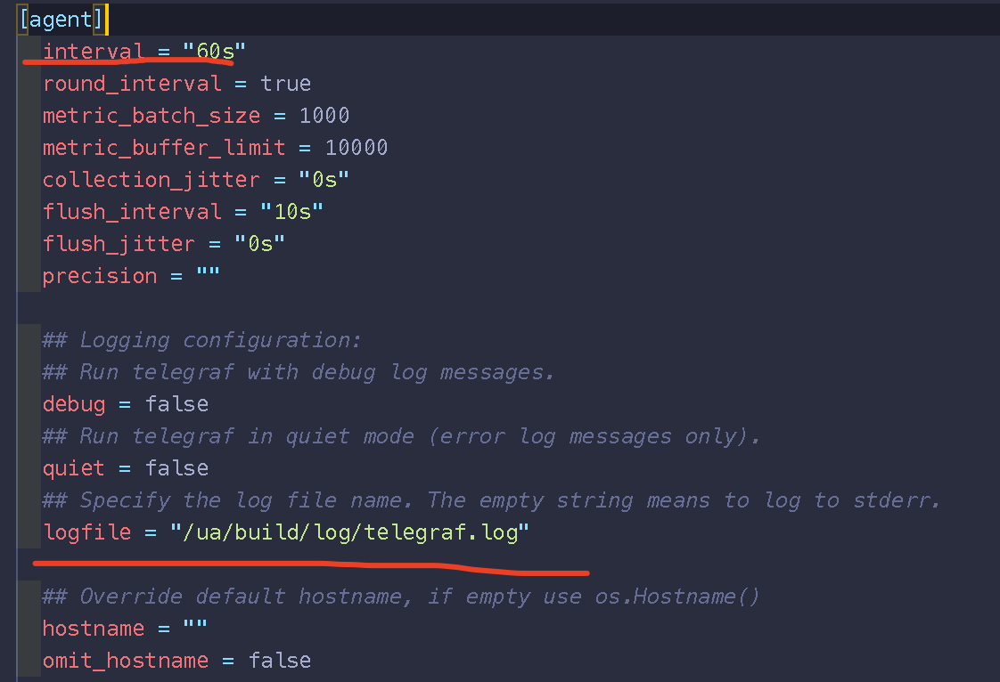

hostname填主机IP

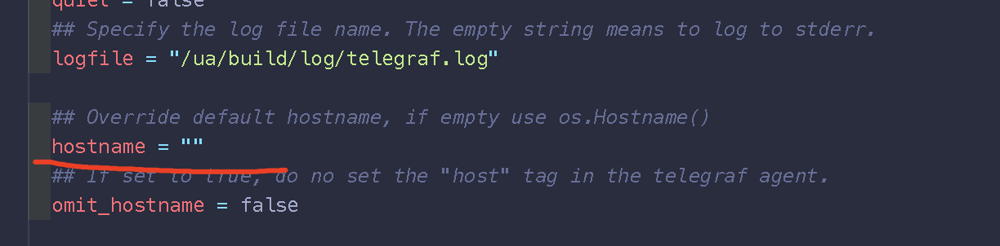       

第二部分 `[agent]` 配置（固定无需修改），主机基础监控配置，windows可注释diskio和processes组件防止报错。

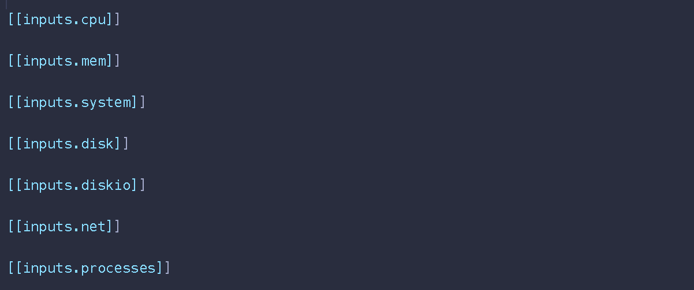

​      注意 windows 下可能有网络磁盘的情况，没法用ignore_fs过滤，可以指定目标磁盘

```toml
[[inputs.disk]]
  ## By default stats will be gathered for all mount points.
  ## Set mount_points will restrict the stats to only the specified mount points.
  # mount_points = ["/"]
  mount_points = ["C:","D:"]

  ## Ignore mount points by filesystem type.
  # ignore_fs = ["tmpfs", "devtmpfs", "devfs"]
```

​      第三部分 `[exec]` 配置，执行脚本对指定文件做分析，需修改脚本的绝对路径、指定检测时间间隔和超时时间。如果没有没有脚本需要执行请注释exec部分

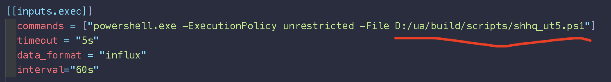

​       `[exec]` 下还可以配置远端服务器端口检测:

​        因端口检测间隔需求为1分钟，且为了准确性，增加对open端口的二次校验，所以会有一小会儿的等待时间。

```
[[inputs.exec]]
  commands = ["C:/Users/xujing/Desktop/dist/portcheck.exe -u -i 192.168.57.32 -p 80,123,53,443"]
  timeout = "60s"
  data_format = "influx"
  interval="60s"
```

命令行参数解释：

​      默认测试tcp端口，测试udp端口需要加 -u

​     -i 后指定 远端主机的IP地址，如：-i 192.168.57.32

​     -p 后可指定一个或多个端口，如：-p 80 或者 -p 80,443

​     --localhost 测试本机的tcp端口是否开启监听，通常后面加 -p 指定本机端口号

​     --icmp 测试对端主机网络是否存活，但现网中存在禁ping的策略可能无法使用该功能

对端TCP端口测试：portcheck.exe  -i 192.168.57.32 -p 80,6443


对端UDP端口测试：portcheck.exe  -u -i 192.168.57.32 -p 53,123


本机tcp端口测试：portcheck.exe  --localhost -p 80

ping测试：portcheck.exe  --icmp -i 192.168.57.32 

状态码对应解释

> 开启 Open —— 1
>
> 关闭 Closed —— 0
>
> 被过滤 Filter  —— 2
>
> 其他异常 —— 3 (比如银证备用侧主机130的网卡被删除)

​      第四部分 `[procstat]` 配置，配置需要监控的进程，可以使用exe或pattern参数，去匹配目标进程，cmdline = true 会显示进程的路径、命令行信息，pid_finder = “native” 建议不要改变使用系统自身的。

> pattern :进程特征字段，支持%模糊匹配（如：%钱龙卫星%），如果主机内有多个进程与该字段匹配，可统计出这些进程的数量，逐一输出各个进程的资源消耗。适用场景：进程以MainWindowTitle运行，多个进程名称相似（必要cmdline = true）

> exe: 可执行文件名称（如：ut5），精确匹配该进程名，统计进程数量和资源消耗，适用场景：单个进程，同一个名字的进程有多个path（必要cmdline = true）

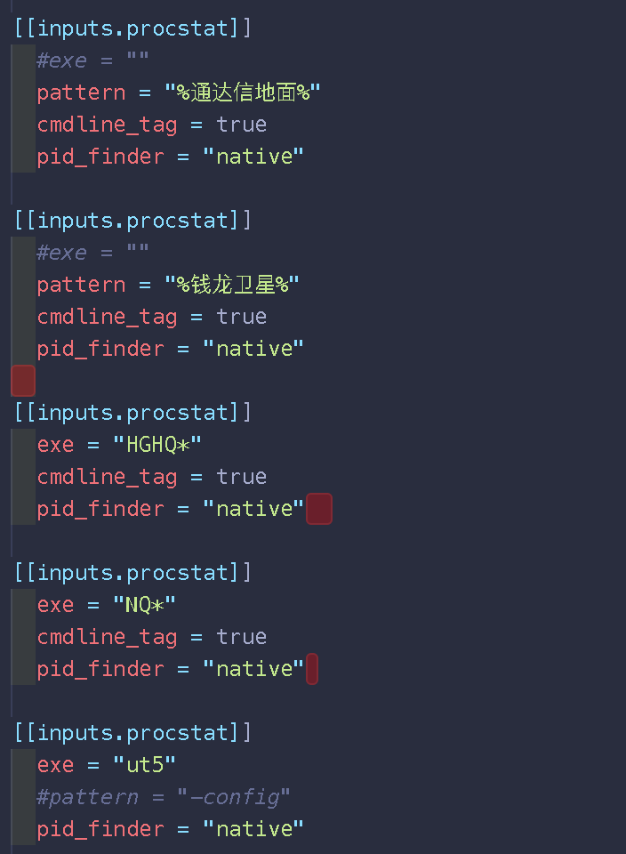

第五部分 `[filestat]` 配置，检查指定文件是否发生变化，md5 = true会显示md5值，如果不需要检测文件状态请注释掉此部分

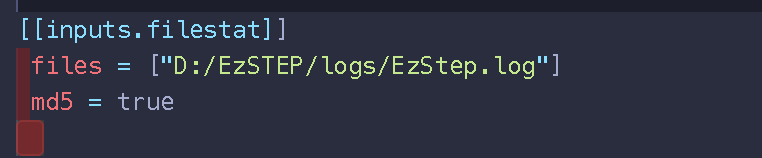

第六部分 `[tail]` 配置日志采集，如果不需要日志监控请注释掉此部分。功能说明：

1）需指定文件路径，支持用*通配；

2）如果存在很多日志文件，需指明使用2020年以后的日志（如：202*_GLSC-LS-0--1.log），tail会自动寻找到最近日期的log文件来读取

3）encoding为文件编码格式，现在遇到的日志文件都是GBK编码，如果有GB2312或其他格式，需要更改。

4）name_override 需要修改日志属性，是行情还是报盘还是其他，当前有shhq_log、shbp_log、bp_log、o32_log、hsmid_log等

5）规则不需要修改，默认全部转发，不对日志解析处理，

6）若日志有多行需要开启multiline功能，目前发现存在单行多行同时在一个文件出现的场景，建议默认都开启multiline

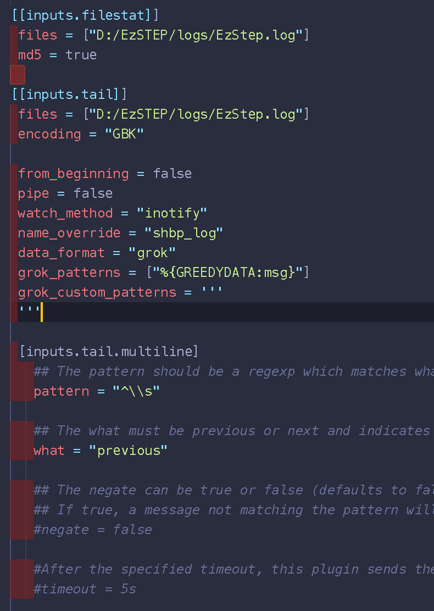

输出部分：

第一部分 `[prometheus_clinet]` 配置无需改变

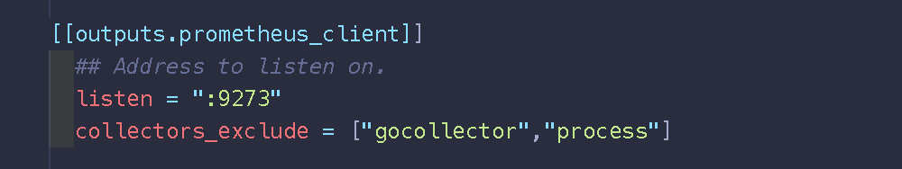

第二部分 `[graylog]` ，需要修改namepass和日志中的name_override一致，如果有多个需要按数组格式填多个值。如果无日志监控请注释掉此部分。这里的namepass用于日志过滤，发送到graylog需要开通网络端口。

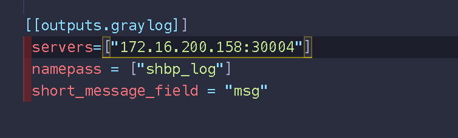

3. 测试配置是否有问题

```cmd
d:\
cd ua\build\
unified-agent.exe -config unified-agent.conf -test
```

若无明显报错，且没有异常退出说明配置正确


4. 访问下127.0.0.1:9273/metrics，有metrics说明启动正常，搜索到配置的metrics说明conf或script配置正确

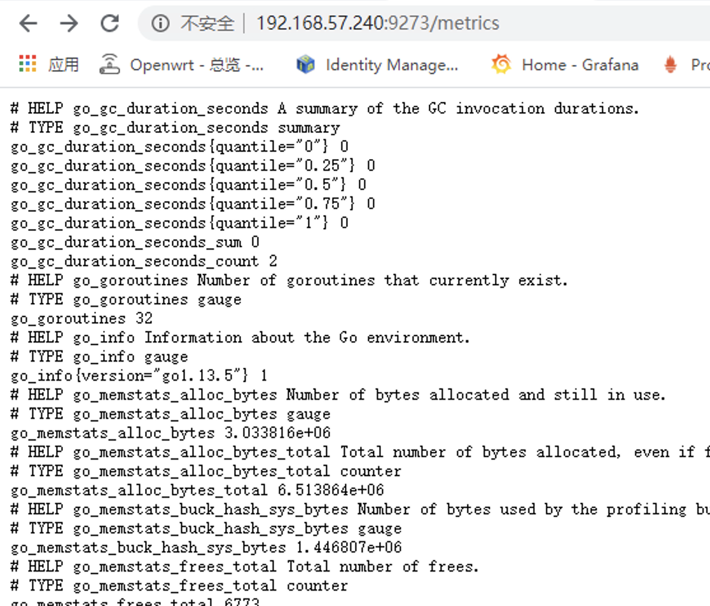


5. 双击下图vbs文件以运行unified-agent

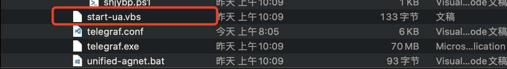

设置开机自启动：将vbs文件创建快捷方式，打开 `cmd` 输入 `shell:startup` 放入快捷方式

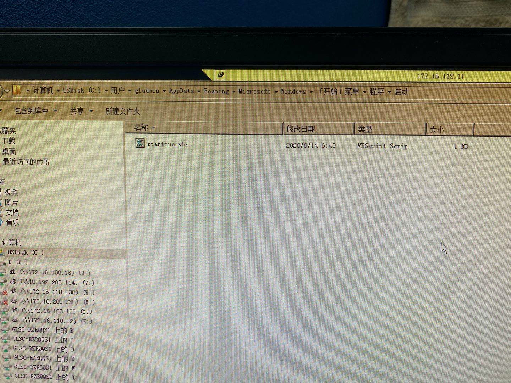


6. 注册到consul

```shell
curl -X PUT -d '{"id": "ZT-shust-bp1","name": "UST","address": "10.192.209.25","port":9273,"tags": ["ua","ust","shanghai","bp1"],"checks": [{"http": "http://10.192.209.25:9273/metrics","interval": "5s"}]}' http://172.16.200.155:31117/v1/agent/service/register
```

在155机器上执行。

7. 修改scripts

##### 查找目录下是否有 `*.biz` 文件 --findbiz.ps1

适用中间件，需要修改变量为存放行情文件的路径，统计目录下biz文件数量

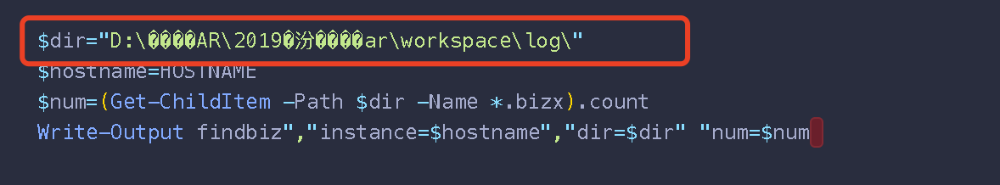

##### 查找目录下是否有 `fiy{yyyyMMdd}.txt` 文件  --findbiz.ps1

适用交易网关，需要修改变量为存放行情文件的路径，查找是否有交易日当天的文件生成，值为1则正常，为0告警

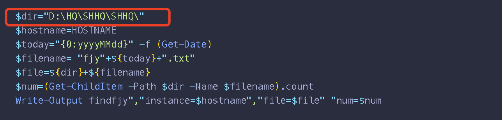

##### 上海行情文件解析

shhq.ps1——适用新版上海行情，需要修改变量为文件存放的路径和本机的IP

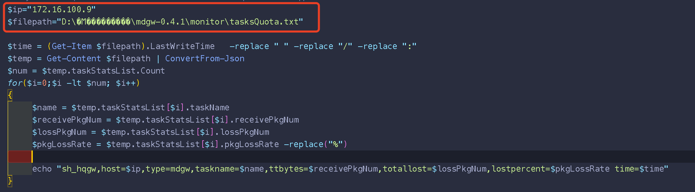

shhq_ut5.ps1——适用旧版上海ut5行情，只需要修改变量为本机的IP

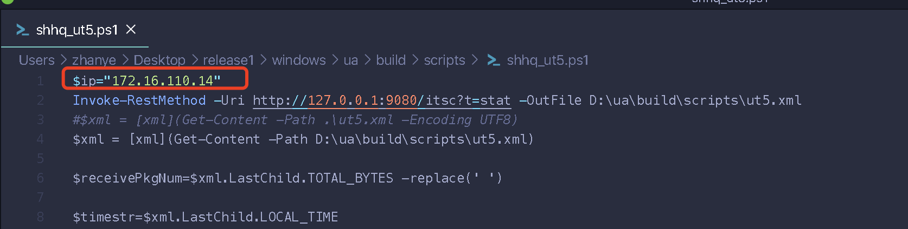

##### 上海交易报盘文件解析

适用报盘、期权、ust，需要修改变量为文件存放的路径和本机的IP

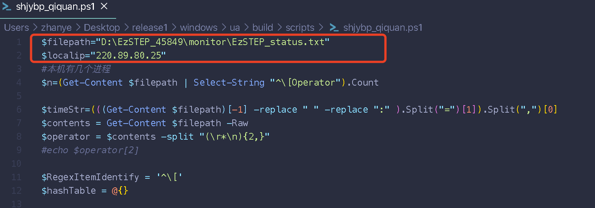


## 在Linux上安装步骤

必须以root用户部署，先解压到 `/ua` 下

```shell
su - root
tar -xzvf linux-ua.tar.gz -C /ua/build/
cd /ua/build/
chmod +x unified-agent
```

修改配置文件：

​      hostname填主机IP

       

​       第二部分 `[agent]` 配置（固定无需修改），主机基础监控配置，这里主要对Linux中的disk进行过滤

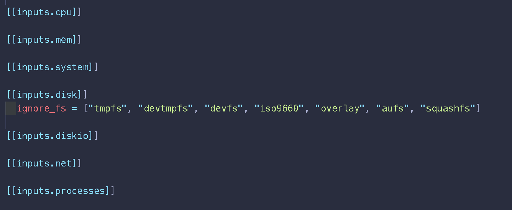

添加需要监控的进程，和windows一样，有进程名字类似的也支持*模糊匹配

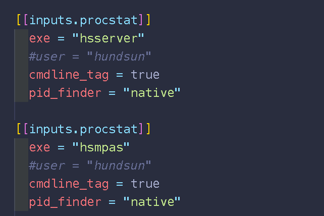

Linux主机如果是32位系统需使用portcheck32，其他64位主机使用portcheck

测试配置是否有问题，若无明显报错，且没有异常退出说明配置正确

```cmd
cd /ua/build/
unified-agent -config telegraf.conf -test
```

 创建开机自启动

```
## RHEL/CentOS 6.5
cp ua.sh /etc/rc.d/init.d/
chmod +x /etc/rc.d/init.d/ua.sh
chkconfig --add /etc/rc.d/init.d/ua.sh
chkconfig ua.sh on

## RHEL/CentOS 7
cp telegraf.service /usr/lib/systemd/system/
systemctl start telegraf
systemctl status telegraf

## SUSE
cp ua.sh /etc/init.d/
chmod +x /etc/init.d/ua.sh
chkconfig --add /etc/init.d/ua.sh
chkconfig ua.sh on
```

打开浏览器访问下hostip:9273/metrics

```
curl http://hostip:9273/metrics
```

注册到consul

```shell
curl -X PUT -d '{"id": "ZT-shust-bp1","name": "UST","address": "10.192.209.25","port":9273,"tags": ["ua","ust","shanghai","bp1"],"checks": [{"http": "http://10.192.209.25:9273/metrics","interval": "5s"}]}' http://172.16.200.155:31117/v1/agent/service/register
```


## 注册到consul

1. 注册规则说明

> id:  <机房>-<业务系统名称/主机名>-<功能名称>

> name: 服务名称按照业务/系统名称<如: HQ-JK>

> address: 主机IP

> port: 默认使用9273

> tag: “ua”(固定标签)，<业务/系统名称如：hangqing> ，<机房如：中心ZX、灾备ZB>，<自定义标签，如：地区、功能名称等>

> check: "http://<ip>:<port>/metrics", 检查间隔x秒

> 注册服务器API：http://172.16.200.155:31117/v1/agent/service/register

2. 注册命令

```shell
curl -X PUT -d '{"id": "ZT-shust-bp1","name": "UST","address": "10.192.209.25","port":9273,"tags": ["ua","ust","shanghai","bp1"],"check": [{"http": "http://10.192.209.25:9273/metrics","interval": "5s"}]}' http://172.16.200.155:31117/v1/agent/service/register
```


## 注销服务

```shell
curl -X PUT http://172.16.200.155:31117/v1/agent/service/deregister/ZT-shust-bp1
```

````------